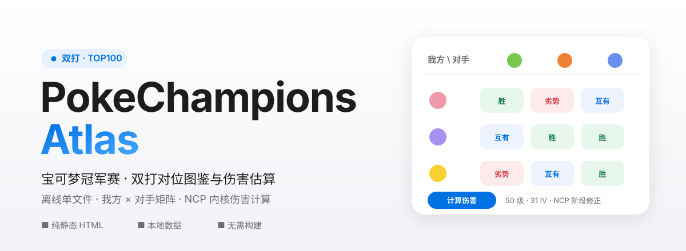
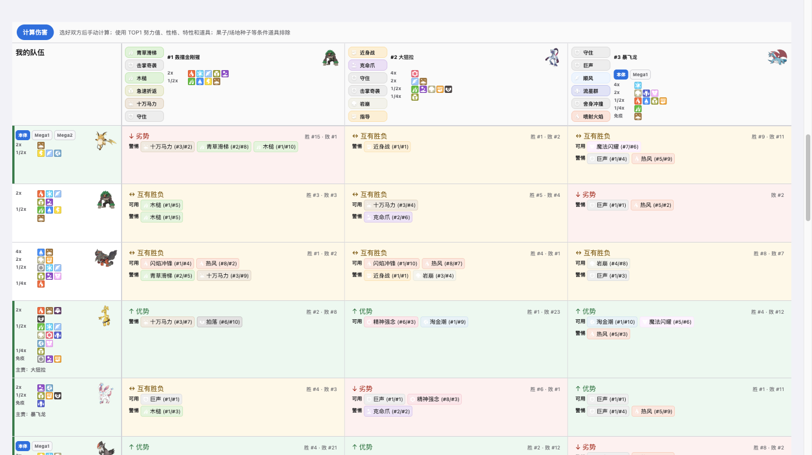
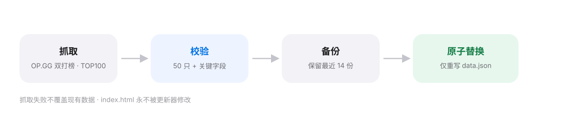

<p align="center">
  
</p>

<p align="center">
  <a href="#快速开始"><b>快速开始</b></a> ·
  <a href="#它能做什么">它能做什么</a> ·
  <a href="#伤害估算">伤害估算</a> ·
  <a href="#更新数据">更新数据</a> ·
  <a href="#许可与来源">许可与来源</a>
</p>

**PokeChampions Atlas** 是一个离线优先的宝可梦冠军赛（Pokémon Champions）**双打对位图鉴**。打开一个 HTML 文件，就能看到「我方 × 对手」的胜负矩阵，并对选定的双方手动估算伤害——无需构建、无需后端、无需实时联网抓取。

<p align="center">
  
</p>

## 它能做什么

- **对位矩阵** —— 我方固定为行、对手固定为列，单元格直接标注 `胜` / `劣势` / `互有胜负`，并给出可用招式与需警惕的招式。
- **快速对位（6 选 4）** —— 在候选队伍中，推荐的 4 只通过左侧绿色行头与主要分工直接标出。
- **完整 TOP100 矩阵** —— 相同方向的全量对位，条目数由 `data.json` 决定，桌面端首行与我方列吸附固定。
- **伤害估算** —— 选好双方后手动点击「计算伤害」，基于裁剪版 NCP 伤害内核在本地计算，无需联网。
- **形态与速度** —— 普通形态与各 Mega 形态分行展示，按冠军赛 50 级 / 31 个体值规则估算速度点。

## 为什么是这样设计

- **单文件、零依赖**：运行期只需要 `index.html` 与 `data.json` 两个文件，可直接部署到任意静态服务器。
- **抓取与浏览分离**：页面**不实时抓取** OP.GG，只读本地 `data.json`；数据更新由独立脚本完成，二者互不影响。
- **诚实的聚合口径**：努力值 / 性格 / 特性 / 道具的 TOP1 是**各自独立**的聚合榜首，**不保证来自同一套实战配置**——README 与页面都明确标注这一点，不伪装成单一 build。

## 快速开始

浏览器通常不允许 `file://` 页面用 `fetch()` 读取本地 JSON，因此需要启动一个静态服务器：

```bash
python3 -m http.server 8000
# 或直接运行 ./start.sh
```

然后访问 <http://localhost:8000/> 。也可以把整个目录部署到任意静态网站服务。

> 宝可梦与属性图标通过 OP.GG CDN 加载，显示图标需联网；图标加载失败时页面保留占位空间并继续展示文字、矩阵与速度计算。

## 伤害估算

快速对位选择双方后点击「计算伤害」：`可用` 按我方攻击对手计算，`警惕` 按对手攻击我方计算；完整矩阵不执行伤害计算。

- 固定使用 **50 级、31 个体值**，分别取双方 Stat Points / 性格 / 特性 / 道具的各自 TOP1。
- 计入按 NCP 阶段生效的道具：讲究系（Band / Specs）、生命宝珠、突击背心、专爱头带、力量头带、博识眼镜及明确的属性增伤道具。
- 排除：一次性减伤果、普通果子、场地种子、宝石、气球、超级石等；已识别但尚未覆盖的道具只展示不计入。
- 不参与计算：天气、场地、能力等级及其他现场状态。双打范围招式按同时命中两个目标施加 `0.75` 修正。

普通形态与每个 Mega 形态分别占一行、只显示攻击百分比；防守形态的组合可通过悬浮、键盘聚焦或点击查看轻量 popover（补充道具状态、特性来源与各防守形态范围）。


## 速度估算

取努力值 TOP1 与性格 TOP1（两张独立聚合表的榜首）。普通与各 Mega 形态共享这组输入，但按各自种族速度生成独立速度点。
- 不考虑顺风、麻痹、讲究围巾、天气特性、速度等级、戏法空间等战斗状态。

## 更新数据

```bash
./update-data.sh                       # 常规更新
./update-data.sh --dry-run --fresh -v  # 首次建议先预演
./update-data.sh --resume --verbose    # 断点续抓
./update-data.sh --validate-only       # 仅校验现有数据
```

更新器通过 ego-browser 获取 OP.GG 双打榜与各排名图鉴页的「全部」数据，保存招式、道具、特性、性格、努力值、搭档、胜于 / 败于及胜利 / 失败技能，并刷新形态静态资料，**最后只原子替换 `data.json`，不修改 `index.html`**。

<p align="center">
  
</p>

若 OP.GG tier 页结构临时变化，可先保留现有榜单，再运行 `node scripts/enrich-items.mjs` 只更新当前双打主体与 Mega 形态的道具目录（同样在全部映射成功后才原子发布）。

### 更新安全机制

- 50 只及关键字段全部通过校验后才发布；抓取失败**不会覆盖**现有 `data.json`。
- 正式更新前自动备份至 `.update/backups/data.<时间>.json`，保留最近 14 份。
- `.update/checkpoint.json` 支持断点续抓；榜单范围或排名变化时自动失效。
- 排他锁防止两个更新任务同时改数据；恢复时把选中的备份复制回 `data.json` 即可。

## 项目结构

| 文件 | 作用 |
| --- | --- |
| `index.html` | 页面、样式与全部交互（单文件） |
| `data.json` | schema v5：单双打排名面板、形态、速度输入、TOP1 道具目录、伤害元数据、远程图标 URL |
| `damage-engine.js` | 基于固定 NCP Champions 版本裁剪的本地伤害内核 |
| `update-data.sh` / `scripts/*` | 数据抓取、富集、校验工具链 |

## 许可与来源

数据来源为 [OP.GG 宝可梦冠军赛榜单](https://op.gg/zh-cn/pokemon-champions/tier)。Champions Battle Data API 不提供与 OP.GG 等价的「胜于 / 败于 / 胜利技能 / 失败技能」，因此这些关键字段仍由 OP.GG 页面获取。

伤害内核的第三方 MIT 许可与来源说明见 [`NCP-LICENSE.txt`](NCP-LICENSE.txt) 与 [`THIRD_PARTY_NOTICES.md`](THIRD_PARTY_NOTICES.md)。复制或部署本项目时，必须同时保留 `index.html` 与 `data.json` 两个运行时文件。
